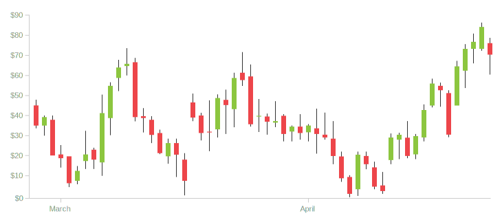

# Candlestick Chart 📈 made with C++

A simple candlestick chart made with C++.    

---

### File Tree 
candlestick  
├── Makefile   
├── README.md  
├── lib  
│   ├── Makefile  
│   ├── candle.cc  
│   ├── chart.cc  
│   ├── main.h  
│   └── util.cc  
├── obj  
│   └── Makefile  
└── src  
    ├── Makefile  
    └── main.cc  

---

### Prerequisites
- make 
- g++ (with gcc) 

### Instructions

1. Install prerequisites.
    ```
    $ sudo apt-get install -y build-essential gcc g++
    ```
2. Run make.
    ```
    $ make all 
    ```